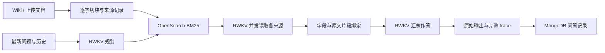

# RWKVRAG — RWKV 原生 RAG

本分支从 [chenqi2013/rwkvrag:bm250820](https://github.com/chenqi2013/rwkvrag/tree/bm250820) 的 `2bbc406125e7e030eda98b11993dc13fc4534ca4` 开始修改，分支名为 `chase/rwkv-native-rag-rebuild`。

Python 主链路使用 **OpenSearch BM25 + MongoDB + RWKV 原生推理服务**。OpenSearch 负责搜索，MongoDB 保存知识库、导入任务和问答记录；两者使用 CPU、内存和磁盘。RWKV 推理使用 GPU。新链路不需要 Qdrant 或 embedding 服务。



## 当前实现

- 新链路独立于旧规则服务，复用 `bm250820` 的 OpenSearch、管理接口和导入能力。
- 原生 `User✿/Bot✿<think` 模板及 `/tokenize`、`/v1/completions`；输入加输出按真实 tokenizer 检查。所有模型阶段共享并发限制，默认 32。
- 不限制每文档两块，不按文档去重。BM25 返回完整块，RRF 按块合并；总候选和总读取来源预算独立配置，未读候选在 trace 中可见。
- Resolver 并发读取原文，按字段选择证据编号；代码只解析和验证编号。Writer 仅接收入选原文及其父级上下文。
- 来源、整篇文本 SHA、块位置、选中片段位置与 SHA 可追溯。FineWiki 导入修复跨批次 ID 碰撞，保留页 ID、版本和语言。
- RWKV 输出原样返回，包括思考封套和长度耗尽时的部分输出。`answer_span` 标出正文范围；不会补引用、删句、改答案或静默重试。
- 问答支持历史；全部 Writer 来源返回，引用表不会因展示 `top_k` 被截断。历史摘要区分运行完成、部分失败和失败，不再把空答案超时误记为已回答。

## 使用

详见 [Python 服务说明](llamaindex-retrieval/README.md)。填写示例配置中的实际服务地址后启动：

```bash
cd llamaindex-retrieval
uv sync --frozen --extra dev
cp .env.example .env
uv run uvicorn llamaindex_retrieval.api:app --host 127.0.0.1 --port 8080
```

示例配置启用 `RWKVRAG_RAG_PIPELINE=rwkv`。没有 `.env` 时保留 `existing` 兼容模式，便于旧接口回归；部署时请明确选择。

## 验证与边界

先验证固定材料 Writer，再检查 Resolver、检索和 Wiki 端到端。开发 smoke 的完成率、事实正确率、引用支持率分别报告，不是生产准确率或新盲测成绩。

纯净 `bm250820` 的原有测试为 **176 通过 / 114 失败**，主要为清除旧语义规则后仍保留的测试预期。新改动与原始基线逐项对照，不放宽断言隐藏失败。本次发布检查为 **466 通过 / 114 失败**，比干净基点新增 290 项通过，失败 ID 完全相同（[日志与逐项对比](llamaindex-retrieval/eval/bm250820-rebuild-20260908/publication-checks/pytest-comparison-publication-v2.json)）。新增测试和真实模型结果见 [本轮验证记录](llamaindex-retrieval/eval/native-smoke/README.md)。

当前是实验开发分支，**端到端质量尚未达标**。固定材料 Writer 基线为 27/28 个事实正确；在 5,000 篇 Wiki、45,960 个逐字块上，最初两轮 8 题开发 smoke 的完整事实与引用通过数均为 0/8。第二轮规划自然完成达到 8/8，但仍存在撤回字段恢复、证据读取格式失败与最终引用遗漏，不能称为可用的完整 RAG。详情见 [Wiki 实验记录](llamaindex-retrieval/eval/native-wiki/README.md)。

字段规划、证据选择和最终引用分别评估；标签存在或 SHA 一致不代表语义正确。应用层跨文档 RWKV state 缓存尚未实现，原生服务的前缀缓存不等于该能力。

旧分支实验说明，增加输出长度、取消分数阈值、加强提示词均不能直接推出质量提升。本分支保留开发测试与失败输出，后续改动需重新测量。

## 其他代码

早期 Go 原型说明移至 [Go 文档](docs/go-prototype.md)。`bm250820` 原有 Python 文档存档于 [旧服务说明](docs/previous-python-guide.md)。新的 RWKV 专属开发入口是上述 Python 链路。
