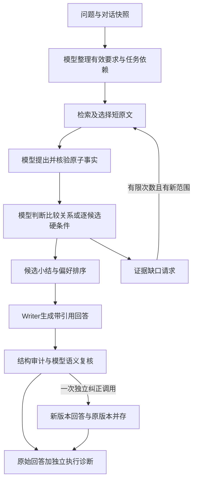

# 比较、选择检索：原子事实、关系判断与阶梯总结

状态：**设计 v1；已开展未晋级的漏斗原型验证，完整设计未实现、未部署。** 用户在本轮结束暂停后授权先完成可评审设计及失败回放方案。当前状态以[CURRENT](CURRENT.md)为准。

## 2026-09-21 实现差距更新

本页是目标设计，不能据此推断正式链路已启用。Typed候选已补充事实类型、条件、资格、决策和预算编排；[实际验证](archive/2026-09/typed-funnel-repair-20260921.md)仍未达到大型选型的语义门槛。正式服务未切换。

| 本页设计要求 | 已实现代码与仍存缺口 |
| --- | --- |
| 有效/撤回要求和用户更正 | 有分节点协议、原话及生效依据绑定；实际仍错分硬条件与撤回，不能标为已解决 |
| 原子事实的具体字段、值、单位、范围 | 有布尔/数量/文本契约、单nullable值和独立单位绑定；13条已见基础节点通过，范围与完整问答未过关 |
| 关系与同范围冲突 | 有同维度汇总及独立核验；模型仍会漏冲突记录、混版本或把未知当否定 |
| 候选资格与偏好排序 | 已有独立条件→资格→决策层和依赖校验；模型条件语义不可靠，不能以结构标签保证推荐 |
| 预算与末层承接 | v10预留完整下游调用、轮转对象/字段、末层只收紧凑结论及逐字证据；整合模型结果见报告 |
| 缺口驱动的补检索 | 未接入新漏斗；本轮只用冻结的已选资料回放 |
| 不变原文与独立审计 | 原始输出不改；新契约以逐字quote定位，辅助ID错误保留审计；之后仍需独立语义核验 |

下一阶段的前置门槛是可靠绑定对象/属性及用户有效要求，不能直接用当前失败协议扩训并宣称完整设计已经落实。历史设计数值和拟议字段见下文，当前实测以报告和CURRENT为准。

## 1. 目标与证据

目标是给出满足最新用户条件、可核对来源、能及时结束的回答，同时保住普通问答。沿用7.2B、本地优化vllm-rwkv；模型大小、采样和State训练不与架构改造同时变化。

[上一轮结果](archive/2026-09/g1j72-state-2k-final-20260921.md)显示：单条件目标/证据一致782/800，完整选择题核心失败31/48→36/48；错误同时出现在证据覆盖、数值关系、硬条件筛选、最终写作。138次未知证据ID中130次来自空证据。7对同输入Planner输出不同，另20对相同Planner下Reader提示/输出集合不同。因此本设计提出的是待验证假设，不承诺调整结构即可解决语义错误。

核心假设：把比较两侧证据、每个候选的条件判断、跨候选排序拆成有显式依赖的小任务，可以降低混对象、漏条件和Writer重复推理的机会。代价是调用、持久化和审计成本增加，必须与体验收益一起测量。

## 2. 已有能力与需要新增的能力

| 部件 | 已有事实 | 本设计的增量 |
| --- | --- | --- |
| 原子证据v7 | [原文、位置、版本及Reader标签](EVIDENCE.md)；value_quote为空，未标准化事实 | 独立模型提出属性值与适用范围，并另存核验记录，原文不变 |
| 分层候选 | plan→observe→assess→writer；旧完整材料160题保留 | 有依赖的事实、关系、候选汇总、排序和Writer输入 |
| choice-contract-v1 | ac604fbf已有29项结构检查，未接入链路 | 复用来源、候选×硬条件覆盖与标签一致性检查；新增比较关系协议、轨迹和编排适配 |
| 2K State | 只学旧conclusion/evidence_ids协议，未晋级 | 初版结构验证用zero State；旧State只在原协议回放中作候选，不猜四状态 |
| 引用前端候选 | 合并数字引用可点击，未正式部署 | 显式来源绑定、逐句引用检查和不可用状态展示，单独整合验收 |

已有choice-contract-v1要求至少一个有效硬条件，不能直接承载纯比较或普通事实题。新设计用外层任务协议组合它，不静默扩展其冻结定义。若需更改字段，另建新版本；原模块和29项测试仍是历史证据。

## 3. 总体流程

普通事实题走提取→简短回答，不强迫建立选择矩阵；纯比较走同维度关系；选择走硬条件→候选资格→偏好；混合题复用同一原子事实及依赖。任务类型由模型判断，代码仅验证协议与路由；不能按题目或实体写规则分支。不确定路由保留明确的未完成诊断或模型澄清，不把旧题变成不支持而移出评测。

## 4. 通用记录与状态

以下是拟议字段，尚不是运行API。每个阶段记录protocol/version、run_id、node_id、parent_ids、input_sha256、精确prompt/token序列、raw_output、finish_reason、checkpoint/State/tokenizer/engine身份、调用时间、token数、证据ID集合和独立call_id。

- `execution_status`：pending/running/completed/invalid/timeout/cancelled/failed。只描述执行。
- `semantic_status`：该阶段模型判断及复核状态；执行失败不转成事实unknown。
- `audit_issues`：结构或标签矛盾，独立附加；不改模型文本。
- `supersedes_call_id`：新纠正调用关联旧调用；原调用不可覆盖。
- ID由编排生成且只在本run内引用，不能依赖T1、E1或连续编号的语义；输入中明确列出允许引用的ID。
- 缓存包含全部依赖内容哈希、任务/范围、协议、引擎/模型/State及解码配置；不只按索引版本或问题文本缓存。
- 只冻结实际访问的来源快照，不声称跨数据库和网站取得了原子事务快照。

## 5. 各层协议与职责

### 5.1 TaskSpec：用户有效要求

输入：逐轮角色、原始内容与版本快照；最新问题。输出：intent、候选对象、请求字段、适用范围、hard_conditions、preferences、有效/撤回要求、用户原文位置及supersedes依赖。

模型解释“最多/至少/不支持”、偏好、版本、历史撤回。代码检查引用来自用户快照、无循环、无重复ID、范围类型正确，不通过关键词规则决定硬条件。助手历史可提供上下文，不能单独授权新要求；资料中的命令不能成为用户更正。

执行无效允许一次独立纠正；仍无效返回阶段失败与原输出。没有材料提到价格，不等于用户没有预算。已撤回字段不能在后续任务中悄悄恢复。

### 5.2 EvidenceUnit：逐字来源

复用现有来源快照、SHA256、Unicode字符范围、文档/索引版本、标题与表头上下文。Resolver选择证据；候选未入选的全文不传给Writer。去重基于同源位置和内容哈希，不合并不同来源的冲突值。

知识库与网络证据都进入同一来源封装，保留origin=kb/web、访问时间、URL/文档版本和可用的发布时间。访问时间不当作内容发布时间。网络来源没有可靠版本时明确标记，不伪造权威排序。

### 5.3 FactProposal + FactAssessment：原子事实

`FactProposal`拟议字段：id、candidate_id、field_id、scope、value_text、unit_text、polarity、source_spans、proposal_call_id。每条是**模型提出的事实解释**，不能因引用字节合法就升为事实。

独立`FactAssessment`绑定proposal及原文，输出supported/unsupported/uncertain、理由、实际用到的evidence_ids和execution_status。它检查对象、字段、否定、单位和适用范围；不是来源真实性认证。发生分歧保留两份判断，最多一次独立复核，不按多数票或“更自信”自动裁定。

代码只检查位置、身份、依赖及格式，不解析自然语言猜数值真伪。数值标准化、单位换算或采用某条修订资料，必须来自带依据的模型输出并接受检查；不靠程序悄悄重算后替换模型答案。当前v7的source claim不能直接转换为supported Fact。

没有检索到证据时保留coverage记录：searched_scope、checked_units、unexamined_units、reason。明确“未公布”的原文是有证据的未知，和根本没有检索结果分开；均不能变成0或不满足。

### 5.4 RelationAssessment：同维度比较

一次判断只输入一个字段、两侧候选及范围、已选逐字证据和原子核验记录。输出：left_candidate_id、right_candidate_id、field_id、scope、left_fact_ids、right_fact_ids、relation、explanation、evidence_ids。

`relation`拟议枚举：less/equal/greater/incomparable/unknown/conflict。数值关系由模型决定。不同量纲或不可对齐模式是incomparable；同一适用范围内未能消解的不同记载是conflict；两对象同值是equal，不能称冲突。

两侧依赖不全时结构审计记录缺口；不允许以一侧材料宣称已完成双侧核验。但unknown/conflict不是代码替模型补出来的标签。模型应明确未知的是哪侧、哪个字段，仍报告已经确定的值。存在修订资料时保留旧值、新值及采用依据，不能用抓取时间自动选新值。

多对象比较按必要的关系任务逐步汇总；超出预算就显式列未完成关系，不通过静默删对象降低任务难度。

### 5.5 ConditionJudgment：逐候选硬条件

复用choice-contract-v1的候选×有效硬条件格子：candidate_id、requirement_id、status、explanation、observation_ids。status为satisfied/not_satisfied/unknown/conflict，必须由模型直接输出。建议新版本另附实际值、用户限制和解释依赖，不能从旧conclusion文本猜标签。

普通事实提取问题不送入“满足/不满足”判定。每个格子仅携带当前候选、当前条件和必要原文，避免把两种候选的条件混成一个满足结果。

### 5.6 CandidateSummary + PreferenceDecision：分子层小结

模型对每个候选输出eligible/ineligible/unresolved及全部硬条件判断ID，再在eligible候选中按用户有效偏好判断。标签一致性预期：全部满足才eligible；存在明确not_satisfied则ineligible；无明确不满足但含unknown/conflict则unresolved。代码只报告标签矛盾，不生成资格、不替模型选赢家。

排序结果保留eligible_ids、unresolved_ids、selected_ids、preference_ids、relation_ids及reason。没有偏好且多项合格时可列出合格集合；同偏好并列返回并列，不能自加价格或品牌权重。

只有一项已证实合格时，可推荐该项为“目前可确认合格”，不要求再证明它比不合格项更好。若还有未决候选，不宣称它是所有候选中绝对最优。所有候选明确不合格与有未决候选但无已证实合格，必须分别表达。

### 5.7 Writer：阶梯总结与引用

顺序为原子事实→候选小结/关系→最终回答。输入含有效用户要求、模型判断、小结及其依赖闭包内Resolver选中的逐字证据；不能仅给总结标签而删掉原文，也不能重塞全部检索候选。

Writer任务是准确呈现已支持的比较和筛选，发现矛盾可以说明矛盾，不能当作新权限改预算或重新推荐已排除项。建议输出结构化statement_id、text、evidence_ids以及完整raw_answer；这些都是新模型协议，需要单独验证，不能由程序回填。

引用分三层检查：ID存在且映射同一快照；位置原文字节一致；原文是否支持对应断言。前两者可机械检查，第三者需模型/评审。未知ID保持未知，缺引用保持缺失，禁止改成看起来正确的来源号。前端只能按显式映射提供点击和范围高亮；原始文字不增删，不能自动补引用。

## 6. 纠正、终止与RWKV上下文

- 每个语义节点使用独立初始State；只有经验证的本请求同节点分块续读可保留状态，不能把候选甲的隐状态续接到乙。需要传递的信息进入显式依赖，不依赖不可审查的隐状态。
- 新阶段提示与旧State不兼容时默认zero；为新协议另训State是后续独立实验。
- 预算草案：单节点输入最多6144 token，Writer原始输出最多2048；其他输出按阶段拟定256～1024；全局最多64次模型调用、180秒。均为待测上限，不是性能承诺。以实际tokenizer计数并扣除生成预算；超过时按完整证据单元分组，不能从句子中间截断否定、表头或引用。
- 预算在规划后计算预计工作量；纠正和补检索也计入同一个上限。无法覆盖请求时显示未检查对象/条件，所有超界题仍保留在回归分母。
- 最多2轮补检索、每轮最多2个模型给出的缺口query；最多读取8个新增证据单元。只有明确的对象/字段/范围缺口进入补查。相同查询、同来源版本及相同内容哈希无新增结果即停止；这只是重复工作检查，不证明语义覆盖。
- 最多1次最终Writer纠正；其余单节点纠正各最多1次且共享64次总预算。标签结构错误和语义复核有独立trace，不用无限重试直到成功。
- 审计本身不改变对外答案。所有候选输出原样可查；存在错误时UI另列状态和诊断。新模型纠正输出作为明确的新版本展示，旧答案保留。预算耗尽时不得用代码拼出一个“安全答案”；无最终模型回答就显示未完成执行状态。
- 流式界面明确“生成中/待核验/有问题/已完成执行”，完成执行不等于语义保证。停止操作阻止后续调度，并尽力取消在途请求；取消未获服务确认时单独说明远端可能仍在运行。

## 7. 一个评审用例（期望，不是模型成绩）

用户：重量≤900克且标准续航≥10小时，满足后优先续航长。甲850克/12小时；乙950克/18小时。

| 步骤 | 期望记录 | 必须发现的错误 |
| --- | --- | --- |
| 原子 | 甲重量850、标准12；乙重量950、标准18，各有来源 | 甲乙串值、标准与节能混用 |
| 硬条件 | 甲两项满足；乙重量不满足、续航满足 | 950≤900判满足；漏掉重量格子 |
| 候选小结 | 甲eligible，乙ineligible | 把乙重新放入eligible |
| 偏好 | 合格集合只有甲，可推荐甲 | 以18小时重新推荐乙；因无第二合格项而拒选 |
| Writer | 推荐甲；说明乙超重；逐项给对应来源 | 说甲比乙续航长；不给引用；连续复述同一段 |

这是设计人员给出的期望，用来审查协议和构造后续gold，不冒充模型已实现的结果。

## 8. 接入顺序与评审出口

1. **当前交付**：本文＋[回放方案](LAYERED_REPLAY_PLAN.md)＋全160对哈希绑定、20对定位材料；没有新模型调用。
2. 离线协议实现：新目录中实现数据结构、依赖审计、快照和回放执行器；先保留现有choice模块边界，不改运行路由。
3. 分阶段模型实验：先定位原链路，再逐层验证新协议；每一步冻结代码/输入/提示/预算，不同时换State。
4. 通过固定材料门槛后单独接检索，随后验证普通问答、网络开关、引用前端及端到端延迟。
5. 新State训练和正式部署分别决策；当前设计完成不代表获得了质量晋级证据。

评审重点：四状态是否足够；未决候选的推荐措辞；来源范围与事实核验是否完整；额外调用成本是否值得；审计失败的产品展示。预算数值、提示文本、持久化/API字段和新独立留出集仍待实现前冻结，不是已经确定的线上配置。
