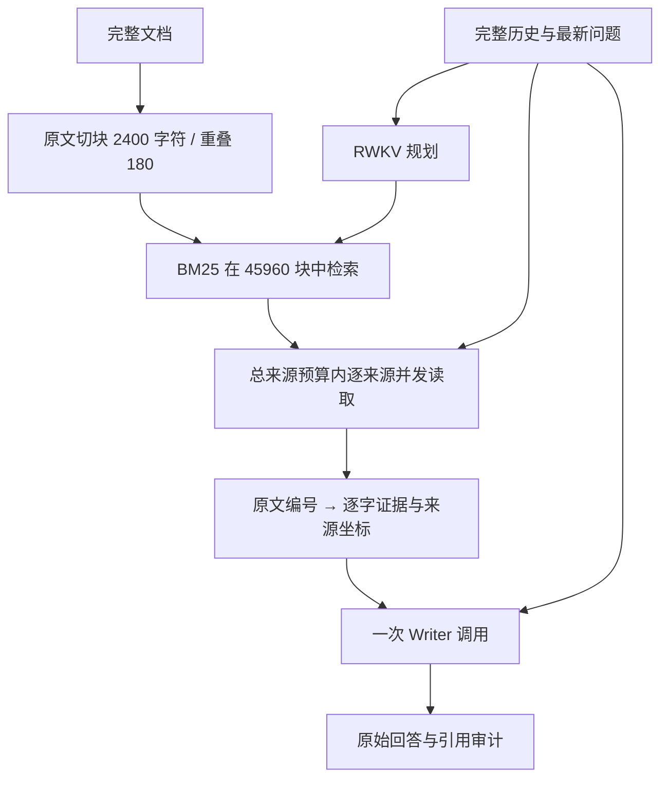

# 当前如何处理超长上下文

当前主要通过检索和逐字证据选择减少 Writer 输入，各次模型调用之间没有延续 RWKV 神经网络 state。代码中的对话历史、任务列表和证据记录是应用数据。它们与模型内部状态是不同机制。

导入和读取都保留来源坐标。每个 Reader 的正文单元软窗口为 1,200 字符、重叠 180，单次按约 6,000 原文字符打包。长表格行和列表项保持完整，因此可能超过软窗口。该数字没有包括历史、任务、父级上下文和 JSON/模板开销，**不是完整输入的 token 上限**。没有“每文档最多两块”；默认总读取 24 来源，已测 Wiki 条件为 80。

目前 Writer 一次接收全部入选逐字片段、父级上下文和完整历史，没有按文档分支汇总或动态状态续读。原 `native` 传输会用 tokenizer 验证输入加输出预算；外部 `rwkvos_batch` 默认只记录预算未知。可选完整 prompt 服务计数与显式应用输入上限属于新增可观测性和资源控制，不等于已解决长距离信息保持，不能把模型名中的 `ctx16384` 当成已验证的服务硬上限。

## 2.9B 实际结果

三份冻结输入把相同的三个合成事实放在前、中、后位置，加入 45 / 84 / 167 篇完整 Wiki 干扰文章。零 state、相同问题和输出预算，每档一次，没有检索、重试或输出修复。

| 服务计数输入 | 正确事实 | 正式引用支持 | 完整通过 | 请求往返 |
| --- | ---: | ---: | ---: | ---: |
| 8,169 tokens | 3/3 | 3/3 | 是 | 3.23 秒 |
| 16,375 tokens | 0/3 | 0/3 | 否 | 4.35 秒 |
| 32,624 tokens | 1/3 | 0/3 | 否 | 4.63 秒 |

三次均返回 200。16K 把资料标题当成属性值；32K 仅答对末尾短语。离线参考词表与服务计数有 1–2 token 差异，不能将参考位置声称为服务端精确坐标。长度、干扰数量和距离同时变化，小样本不能隔离位置效应，也不是 Wiki RAG 准确率。原始请求、回答和逐断言审阅见 [评测归档](../llamaindex-retrieval/eval/rwkvos-29b-20260909/README.md)。

## 四种状态机制

| 机制 | 目前情况 |
| --- | --- |
| 同一次请求内分片 prefill | 上游实现持续更新同一 GenerationState；服务当时报告输入片大小 128。它解决输入计算分片，不保证事实长期保持。 |
| 独立文档并发读取 | 当前已实现；各调用独立，不合并不同文档的神经 state。 |
| 上传 statetune 的初始 WKV state | adapter 可传 `state_id`，本轮没有可用 state、没有上传或训练。它不包含完整动态 shift/elapsed。 |
| 跨请求完整状态续读/分叉 | 上游有 session 路由，当前 RAG 未接入；部署兼容性、会话亲和与分叉语义尚未实测。 |

请求参数 `chunk_size=8` 控制生成输出刷新频率，不是输入分块。上述服务行为来自 [固定版本上游实现](https://github.com/Alic-Li/rwkv_lightning_cuda/blob/6253c9e0345a1c5e42bf0a10e722ba09de06a2ac/src/rwkv_inference_engine.cpp#L275) 与部署探针；远端部署源码版本未独立认证。

## 下一步结构

先对每条完整 prompt 测量 token，明确历史、正文和输出各占多少预算，再测试按文档和任务分支组织逐字证据。分级选择仍须保留原文及坐标，避免用生成摘要替换唯一事实来源。Reader 和 Writer 都需要独立检查证据是否丢失。

若要利用动态 state，先验证“顺序续读”和“一次读入”的结果、同文档状态隔离及分叉能力。生成答案应使用阅读状态的副本，避免生成文本污染后续阅读。当前上传 state 接口不能直接承担这些工作。

RWKV-SearchReader 的经验主要是按文档分支组织读取、并行和分级归并；检查的版本并没有显式神经 state 续读。本项目保留逐字原文和不可变输出约束，不照搬它的正文截断与摘要压缩。statetune 后续针对稳定协议下仍存在的格式、范围和事实保持错误，需要分离训练集与留出集重新检验。
